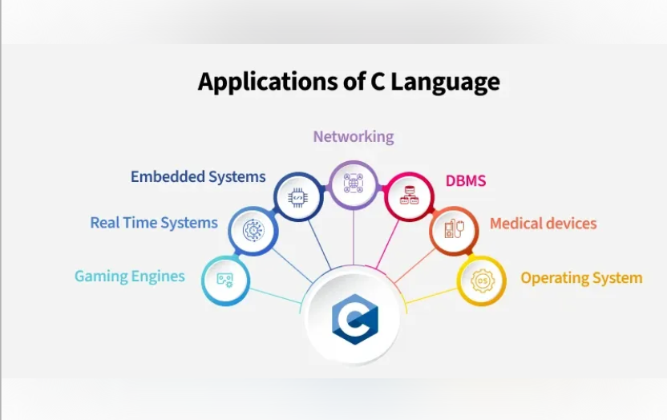
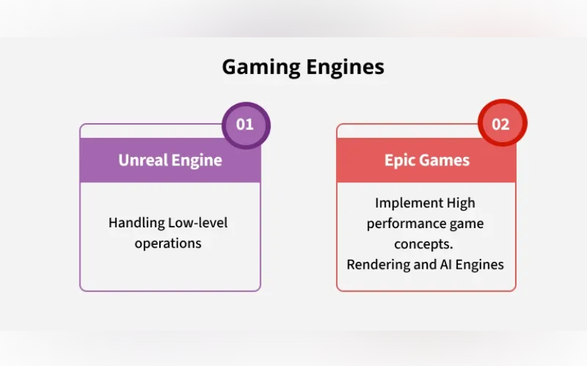
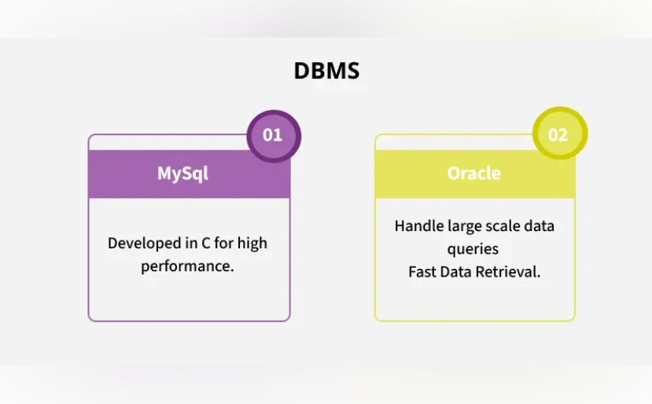
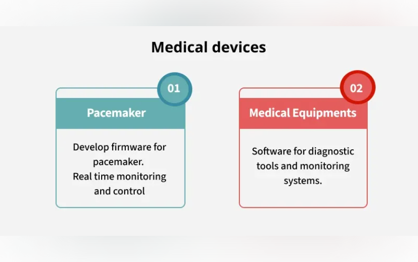
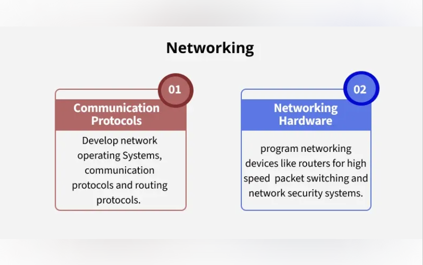
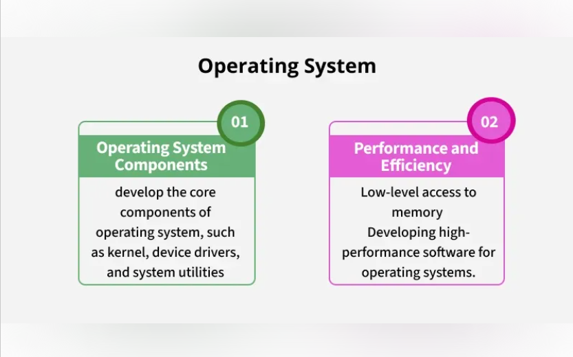
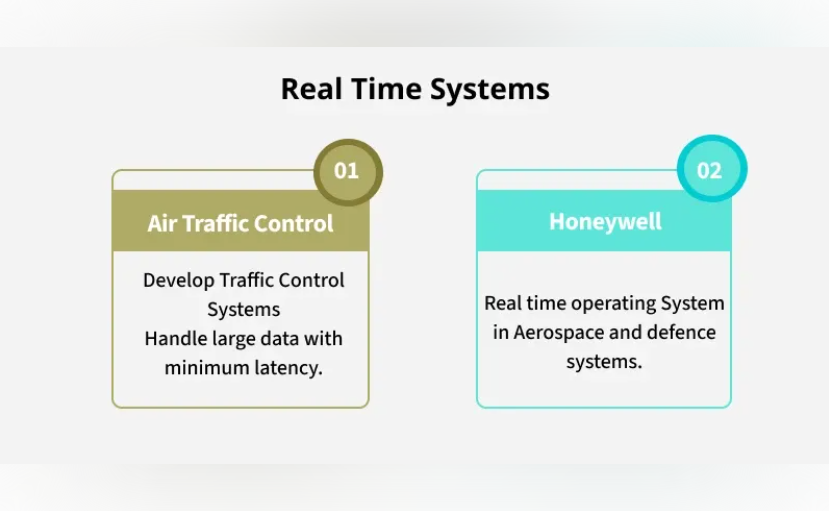

# C Programming

- C is a general-purpose mid-level programming language developed by Dennis M. Ritchie at Bell Laboratories in 1972. It was initially used for the development of UNIX operating system, but it later became popular for a wide range of applications. Today, C remains one of the top three most widely used programming languages.

## Application of C Language

- Gaming Enines
- Real Time Systems
- Embedded Systems
- Networking
- DBMS
- Medical Devices
- Operating System

### Embedded Systems

### Gaming Engines

### DBMS (Data Base Management System)

### Medical devices

### Networking

### Operating System

### Real Time Systems

## Why learn C?
>C is considered as the fundamental language of computer programming. Many modern languages such as C++, Java, Python, and Go derive their syntax from C. So, if you learn C, not only you will have strong grasp of fundamental concepts but also find it easier to learn other programming languages.

> Also, C is used in creating almost all of the operating systems and embedded systems. So, if you have interest in low level coding, learning C is mandatory.